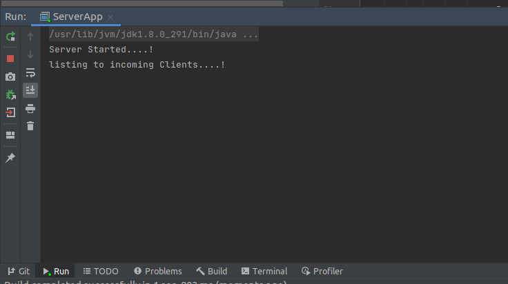

 # **Terminal Chat app using Client Server Architecture** 
 
 
This is a terminal based Chat application build for describing the client server architecture

    How to Run the application?

    01). Clone the repository from https://github.com/ChandimaHerath/ClientServerChatApplication.git 
    
    02). Open up the project with your Java IDE (Intellijidea) 

    03). Build and Run the ServerApp

    04). Run the Client app

    05). Send your messages through the clent app terminal

    06). Retrive your messages in ServerApp terminal

*(You customize the IP address and the port for connecting far two distance devices)*

---

(*Server app*)

--------------------------------------------------------------------------------
        

(*Client app sending messages*)

--------------------------------------------------------------------------------

(*Server app retriving messages*)

--------------------------------------------------------------------------------

### License

Copyright &copy; 2021 - present Chandima Herath. All rights reserved.

Licensed under the [MIT](LICENSE) license

